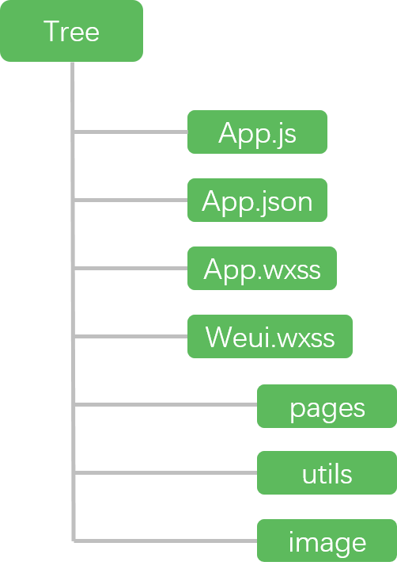
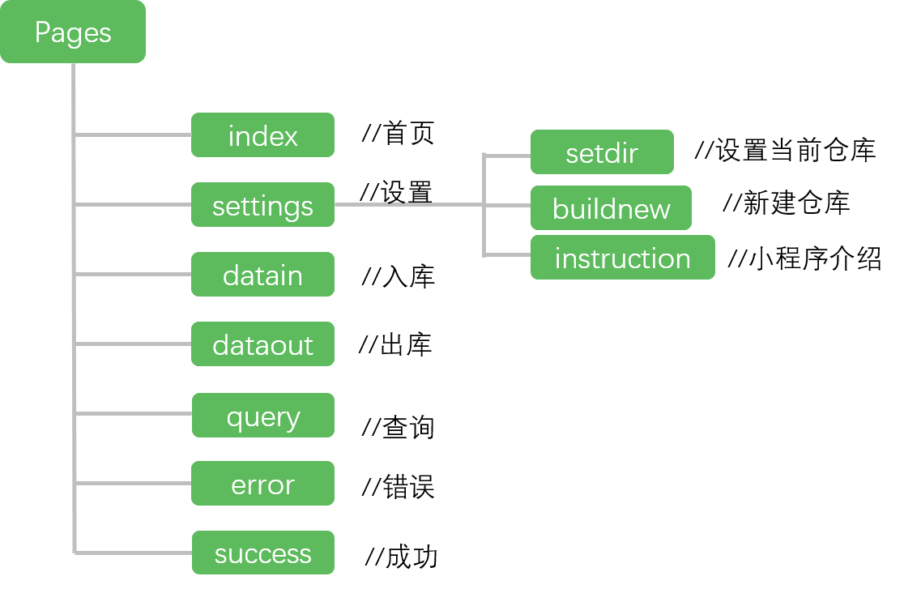

## 扫码小程序前端

#### 文章结构

- 整体代码结构
- 运行流程
- 文件说明
- 几个技术细节 / app 层级 | 生命周期函数 | POST 传参 | 成功失败页面 |  


#### 代码结构

小程序前端的文件结构如下图所示：



简单介绍其中文件的作用，

1. 根目录下 app 开头的三个文件主要为小程序的一些全局设置。
2. weui.wxss 为腾讯为小程序/公众号开发的专用样式表，[github地址](https://github.com/weui/weui-wxss/)。
3. pages 文件夹下包括了本小程序开发的所有页面。
4. image 文件下主要为小程序使用到的图标和图片。
5. utils 文件夹下包含了小程序使用到的通用函数。

接下来重点介绍其中重要、值得注意的部分。

#### 统揽全局的 app.*

#### app.js

在本程序的 app.js 包含了一些重要的全局变量和初始登陆的函数。登陆部分由于涉及到和后端交互，所以我们把这部分放在后端介绍文章中，在此不做详细叙述。
说说全局变量设置，在开发过程中，发现有些变量通用于所有的页面，比如用户信息、请求后台的地址等等。这样只需在每一页进行导入，就可以直接使用到这些变量了。

```javascript
// app.js
App({
    //...
    globalData:{
        userInfo:null,  // 用户信息
        cur_dir: null,  // 目前使用的扫码仓库
        dirs: null,    // 目前所有仓库
        domain: 'https://lab.crossincode.com/scan/',  // 后端根域名
        cookie: ''  // 用户 cookie (用于登录验证)
      },
  })
```

在某一子页面使用示例，只需使用 getApp() 就可以导入 app.js 中的设置，然后在 onload 函数下获取全局变量即可。

```javascript
// index.js
var app = getApp() // 导入app
Page({
    onLoad: function () {
        var domain = app.globalData.domain
    }
    })
```

##### app.json

该文件包含了小程序的一些设置，比如路由、底部导航栏等。小程序中所有页面都必须注册到路由中。


#### app.wxss

该文件包含了一些全局的样式表。


#### pages

pages 文件夹下面的内容为小程序的页面,文件结构如图所示



简单来说每一个文件夹代表了一个页面路径，而每个路径下可以包含多个子路径。文件夹至少包含了 4 个文件，比如首页 index 文件夹，包括了处理数据以及交互的 index.js ,处理页面显示的 index.wxml ,该页面样式表 index.wxss, 该页面配置 index.json。

##### 页面数据交互

熟悉 django 或者 vue.js 的同学应该清楚，在 html 中使用了 "{{ val }}" 的形式表示变量，在小程序中也是一样，一个简单的例子说明小程序中的数据交互形式：

index.wxml
```html

<text>{{nickname}}</text>

```

index.js
```javascript
/**
   * 页面的初始数据
   */
  data: {
    nickname: 'mina'
  },

```
这样一来就将数据绑定好了。另外 wxml 虽然类似于 html ，但使用了一些不一样的标记，比如html中的 div 标签在 wxml 中变成了 view 标签。

##### 页面生命周期函数

在新建了路径文件夹之后，打开 xxx.js 文件，可以看到一些生命周期函数，这里讲一下本程序用到的两个，了解更多信息已经其他函数参考官方文档。

常用的 onload 加载函数如下所示，该函数监听页面加载，在该函数中处理一些页面上需要显示的变量等，比如需要加载用户的头像、昵称等内容，就可以在此函数中更新 data 对象，达到数据交互的作用。

```javascript
/**
   * 生命周期函数--监听页面加载
   */
  onLoad: function (options) {

  },

```

onshow 函数监听页面显示，在本程序中，当用户更新了当前仓库，首页对应显示部分也要发生相应的改变，所以该函数就起到了作用。每次显示时，检查当前仓库。

```javascript
/**
  * 生命周期函数--监听页面显示
  */
 onShow: function () {

 },
```

#### utils

utils 文件包含了一个 tils.js 文件，你可以把 utils 文件夹理解为一个工具箱，工具箱内的工具(函数)可以在所有的页面使用。

本程序前后端数据交互采用了 POST 请求形式，数据类型为 json 格式，在使用 wx.request 接口 POST 请求时，并不能直接将 json 格式的数据发到后台，需要经过一层处理才行，代码如下

datain.js
```javascript
//...

wx.request({
    url: 'https://lab.crossincode.com/scan/datain/',
    method: 'POST',
    // 处理 json 格式的数据
    data: Util.json2Form(data),
    header: {
    'content-type': 'application/x-www-form-urlencoded'
    },
    // 回调函数
    success: function (res) {
        //...
    }
  })

//...
```

Utils.js

```javascript
// ...
function json2Form(json) {
  var str = [];
  for (var p in json) {
    str.push(encodeURIComponent(p) + "=" + encodeURIComponent(json[p]));
  }
  return str.join("&");
}

module.exports = {
  json2Form: json2Form
}

// ...
```

## API 接口

小程序提供了丰富多样的 API 接口，本小程序使用到了以下接口，详细内容参考官方文档：

```javascript

wx.scancode  // 扫码接口
wx.request  // 网页请求接口
wx.navigateTo // 路径导航
// ...

```
